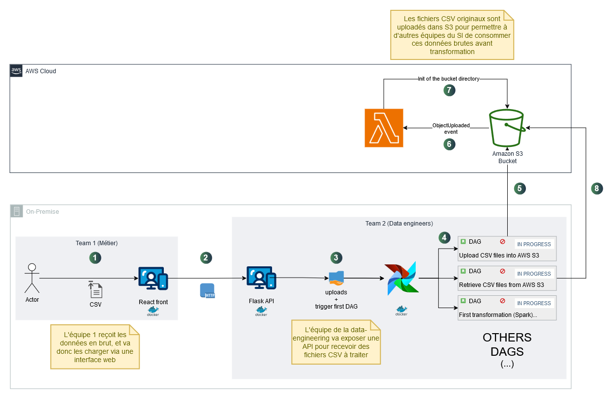

# **Projet Big Data Framework**

L'objectif est de concevoir et d'implémenter une architecture de traitement de données scalable et automatisée, en utilisant l'écosystème Hadoop.

## **Livrables**

- **Pipeline automatisé** : De l'ingestion des données à leur mise à disposition pour analyse.
- **Analyse spécifique** : Réponses aux problématiques propres au dataset sélectionné.
- **Documentation complète** :
  - Schéma de l’architecture
  - Justifications techniques
  - Code source
  - Résultats analytiques

## **Enjeux clés**

- Automatisation des workflows.
- Scalabilité pour gérer des volumes croissants.
- Mise en place d’une infrastructure réutilisable et optimisée pour les besoins analytiques.

## **Schéma de l’architecture**

Voici un aperçu de l’architecture mise en place :



## **Comment démarrer ?**

### Prérequis

- **Docker** : Assurez-vous que Docker est installé sur votre machine. Vous pouvez le télécharger et l'installer depuis [le site officiel de Docker](https://www.docker.com/).
- **docker-compose.yaml** : Ce fichier doit être présent à la racine du projet.

### Étapes pour lancer le projet

1. Ouvrez un terminal.
2. Positionnez-vous à la racine du projet où se trouve le fichier `docker-compose.yaml` :
   ```bash
   cd /chemin/vers/le/projet
   ```
3. Lancez la commande suivante pour construire les images Docker et démarrer les conteneurs :

   ```bash
   docker-compose up --build
   ```

Attendez que tous les services soient démarrés. Une fois prêts, ouvrez un navigateur et accédez à l'adresse suivante :

```bash
http://localhost:3000/
```

Utilisez l'interface graphique pour soumettre vos fichiers CSV correspondant aux datasets à analyser.

Lorsque vous avez terminé, vous pouvez arrêter les conteneurs en utilisant la commande suivante dans le terminal :

```bash
docker-compose down
```
